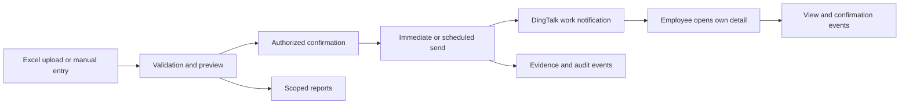

# Internal Salary Slip Application Design

## Objective

Build a DingTalk internal application that recreates the selected capabilities of Smart Salary Slip while using an independent application, backend, database, and visual identity.

The application serves the organization through DingTalk web views:

- Administrators use a desktop management interface.
- Employees receive a DingTalk work notification and open their own salary details directly in the DingTalk mobile client.

## Scope

Included modules:

1. Salary slip management
2. Salary payment evidence
3. Report center
4. Permission management
5. System settings

Excluded modules:

- Annual bonus threshold optimization
- Social security payment
- Salary calculation
- Gig-worker settlement
- Human-cost statistics

## Product Rules

### Salary Slip Management

- HR or finance users with explicit authorization can create a monthly salary batch by uploading an Excel file or entering rows manually.
- Import validation checks employee identity matching, mandatory fields, numeric formats, duplicated payroll periods, and duplicate employees in a batch.
- A batch remains a draft until an authorized user previews and explicitly confirms it.
- An authorized user can send immediately or schedule a future send time.
- A sent batch tracks recipient delivery, viewing, and confirmation states per employee.
- Authorized users can correct, withdraw, and resend a batch. Each operation produces an audit record.
- The management list supports payroll-month filtering, status counts, title search, and batch-level administrator assignment.

### Employee Experience

- DingTalk work notifications do not include salary amounts.
- Selecting the notification opens the employee's salary detail in the DingTalk mobile client.
- The backend identifies the current DingTalk user and only returns records belonging to that user. Client-provided employee identifiers are never trusted for authorization.
- Employees can view their own active salary slips for the latest 12 months.

### Salary Payment Evidence

- The evidence list supports employment status, department, name, employee number, and job-title filters.
- Each employee's evidence timeline records the salary batch, send timestamp, delivery result, view result, confirmation result, and relevant salary-detail fingerprint.
- Evidence is append-only. Corrections and withdrawals create a new traceable event instead of overwriting prior evidence.

### Report Center

- Administrators choose a payroll-month range and authorized organizational scope.
- The system provides human-cost and employee-salary summaries with drill-down detail and spreadsheet export.
- Reports only aggregate salary records within the caller's authorization scope.
- Export events are audited with the actor, filter criteria, row count, and result.

## Roles and Access Control

| Role | Assignment | Access |
| --- | --- | --- |
| Main administrator | The enterprise administrator is assigned by default. | Can manage every salary batch, all historical data, encrypted archives, evidence, reports, permissions, and system settings. |
| Salary-sheet administrator | Manually added by a main administrator to individual salary batches. | Can manage only assigned salary batches and their complete history, including send, withdraw, resend, evidence, and scoped reports. |
| Sub-administrator | Manually added by a main administrator. | Can send salary slips and manage only salary batches in which they are explicitly included as a salary-sheet administrator. Cannot access global history, archives, permissions, system settings, or unassigned batch data. |
| Employee | Derived from the DingTalk identity. | Can read only their own active salary slips and confirmation state. |

HR, finance, and all other users have no salary-data access until manually assigned to an administrative role or a specific salary batch.

Authorization is evaluated server-side for every read, export, send, withdraw, resend, and role-management operation. Authorization changes are audited.

## System Settings

- Employee salary-slip visibility is limited to the latest 12 months.
- After 12 months, a salary slip moves from active storage to encrypted archive storage. Only the main administrator can access the archive.
- This release does not automatically physically delete archived salary data. A future retention-deletion policy requires an explicit compliance decision.
- Optional password verification can be required before entering the employee salary-slip area.
- Notification mode is configurable: DingTalk work notification, or DingTalk work notification plus a pending confirmation task and reminder.
- The system supports a payroll-day reminder and a setting to show employees only the salary-slip experience.
- An operation-log view exposes uploads, imports, edits, sends, withdrawals, resends, exports, archive reads, and authorization changes.

## Data Model

Core records:

- `salary_batch`: payroll period, title, state, schedule, creator, scope, and administrator assignments.
- `salary_item`: encrypted per-employee compensation fields, linked to a DingTalk user ID and salary batch.
- `delivery_event`: one record for each notification attempt and its delivery outcome.
- `view_event` and `confirmation_event`: employee interaction events.
- `payment_evidence`: immutable salary-payment evidence events and record fingerprints.
- `report_snapshot`: authorized aggregate results used for reports and exports.
- `archive_record`: encrypted active-to-archive transition metadata.
- `audit_event`: append-only trace containing actor, action, target, outcome, timestamp, request correlation ID, and failure details when applicable.

Salary amounts and salary field payloads are encrypted at rest. Access to decrypted detail is limited by the role and batch scope above.

## SQLite Persistence Decision

This first production deployment uses one dedicated SQLite database because the application runs as a single API process on the existing 2 GiB Alibaba Cloud host. The database is not shared with the BI application.

- The database path is supplied by `SALARY_DATABASE_PATH` and must be outside the deployed release directory.
- SQLite runs in WAL mode with foreign keys enabled and a bounded busy timeout. A second application process against the same database is unsupported and must fail at startup.
- Salary field payloads remain AES-256-GCM encrypted before persistence. The database file, encryption key, and backup directory use separate service-account permissions from BI.
- Each write is a SQLite transaction. Storage errors are logged with the request correlation ID and returned as failures; no memory fallback is allowed.
- The server creates a timestamped encrypted backup before the daily retention job. Uploading backups to OSS is a separate deployment task because it requires the organization’s OSS bucket and credentials.

## State and Delivery Flow

Batch states are `draft`, `scheduled`, `sending`, `sent`, `partially_failed`, `withdrawn`, and `archived`.

## Failure Handling and Observability

- Invalid import rows are returned with the row number, employee reference, field, and validation reason. A batch with errors cannot be sent.
- Delivery failures retain the DingTalk error and retry state per employee. A partial delivery is reported as `partially_failed`; it is never presented as a completed batch.
- Scheduled jobs record task IDs, run durations, affected records, successful records, failed records, and retryable status.
- Unauthorized, expired, or mismatched employee-detail requests are rejected and audited with a correlation ID.
- Logs and audit records must not contain plaintext salary amounts or credentials.

## Acceptance Criteria

1. Authorized HR or finance users can import and manually create salary batches, while unauthorized users cannot.
2. Invalid salary data blocks a send and identifies every failed row without dropping records silently.
3. An employee can open only their own salary detail from a DingTalk notification.
4. Immediate and scheduled sends correctly track delivery, view, confirmation, withdrawal, and resend outcomes.
5. Evidence and audit timelines remain traceable after a correction or withdrawal.
6. Reports and exports honor role and assigned-batch scope.
7. Main administrators can access encrypted archives after 12 months; employees, sub-administrators, and salary-sheet administrators cannot.
8. Permission changes take effect on the next server request and are recorded in the audit log.
